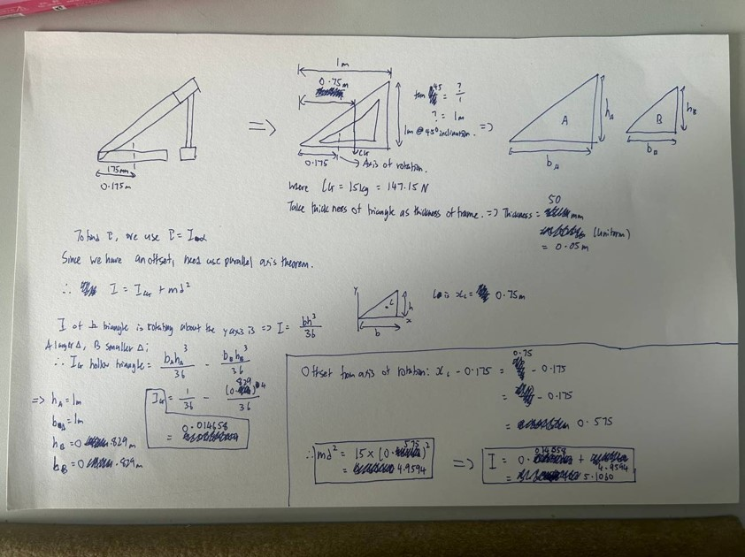
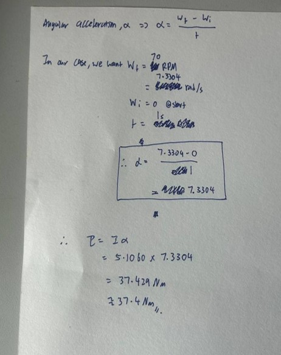
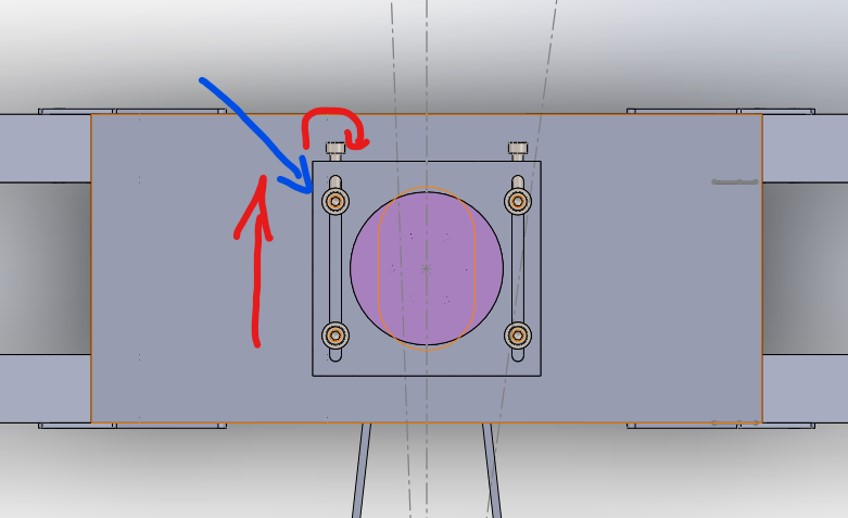
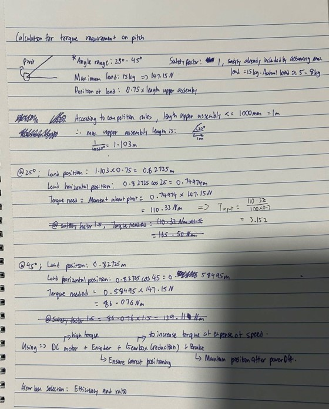

# Appendix
<!-- Fill in according to sequence of mention in the report <-->
## Appendix 1: Roles of Robots in the lineup other than Dart
 
Some robots perform an attacking function whereas others like engineer or radar perform a more support function like providing enemy robot location or picking up boxes. 
 

  

{: .text-center}

<em>Robot Roles</em>

## Appendix 2: Team’s Strategy for focus on Base
 

  

{: .text-center}

<em>Captain's Reasoning for Team's Strategy for dart system  to target Base</em>

## Appendix 3: Damage Mechanism and the Buff & Debuff mechanisms
 
The below buffs , damages and debuffs are summarised from page 75 of the Robomaster 2025 University Championship Rules Manual
 
### Damage Mechanism
 

  

{: .text-center}

<em>Comparison of projectile damage to Targets (Base & Outpost)</em>

 
Dart deals more damage than other projectiles. 

### Attacking Team Buffs and Opposing Team Debuffs upon successful Dart hits
 

  

{: .text-center}

<em>RMUC Terminologies for Dart Buffs and Debuffs</em>

 
 

  

{: .text-center}

<em>Buffs and Debuffs table for varying targets and settings</em>

 
 

## Appendix 4: Design Considerations for Board Selection Table
 
Below are 16 boards with small form factor, GPIO capabilities and camera port separated by their various brands.
 

  

{: .text-center}

<em>Various Boards Table 1</em>

 
 

  

{: .text-center}

<em>Various Boards Table 2</em>

 
 

  

{: .text-center}

<em>Rejected Boards and Justification for Rejection</em>

 
We are then left with the 5 boards: OpenMV RT1062, N6, ESP32 WROOM CAM, XIAO ESP32 S3 SENSE and REALTEK AMB82 as shown in the Board Selection section.
 

## Appendix 5: Torque Calculations
 
Torque, T is minimum torque required to move the servo horn with the fin attached against gravity. 
Weight of Horn and Fin, F is the mass x gravitional force = weight that gets acted on the horn and fin by Earth
Distance, d is the distance from the centre of the servo horn to the top of the fin

\
T = Fd

\
  = 2.3g x 15.2mm

\
  = (2.3 x 10^{-3})(9.81)(15.2 x 10^{-3})

\
  = 3.4295 x 10^{-4}N·m

## Appendix 6: PCB Schamtic and BOM

### PCB Schematic
 

  

{: .text-center}

<em>Right Servos and OpenMV Board Power Schematic [Segmented]</em>

 
 

  

{: .text-center}

<em>Left Servos Schematic [Segmented]</em>

 
 

  

{: .text-center}

<em>Battery Input Schematic [Segmented]</em>

 
 

  

{: .text-center}

<em>LM1085 Voltage Regulator Schematic [Segmented]</em>

 
 

  

{: .text-center}

<em>Dart Trigger Power Schematic [Segmented]</em>

 

### BOM

| No. | Link | Description | Qty | Total (SGD) |
|----:|------|-------------|----:|------------:|
| 1 | [LM1085IS-ADJ-NOPB](https://www.digikey.sg/en/products/detail/texas-instruments/LM1085IS-ADJ-NOPB/363561) | Linear voltage regulator, adjustable, 3A | 1 | 3.55 |
| 2 | [GCM188R71H104KA57D](https://www.digikey.sg/en/products/detail/murata-electronics/GCM188R71H104KA57D/1641698) | 0.1 µF, 50V, X7R, 0603 | 4 | 1.16 |
| 3 | [GRM21BC71C106KE11L](https://www.digikey.sg/en/products/detail/murata-electronics/GRM21BC71C106KE11L/4905486) | 10 µF, 16V, X7S, 0805 | 4 | 1.60 |
| 4 | [293D106X5016C2TE3](https://www.digikey.sg/en/products/detail/vishay-sprague/293D106X5016C2TE3/1578618) | 10 µF molded tantalum capacitor | 2 | 2.54 |
| 5 | [CRCW1206365RFKEA](https://www.digikey.sg/en/products/detail/vishay-dale/CRCW1206365RFKEA/1176593) | 365 Ω, 1%, 0.25W resistor, 1206 | 1 | 0.15 |
| 6 | [RNCP1206FTD121R](https://www.digikey.sg/en/products/detail/stackpole-electronics-inc/RNCP1206FTD121R/2240317) | 121 Ω, 1%, 0.5W resistor, 1206 | 1 | 0.15 |
| 7 | Taken from Workshop | 8-pin header, 2.54 mm | 2 | nil |
| 8 | [16SVPF180M](https://www.digikey.sg/en/products/detail/panasonic-electronic-components/16SVPF180M/4204811) | 180 µF, 16V polymer capacitor, SMD | 4 | 3.92 |
| 9 | Taken from Workshop | XT30-M connector (workshop) | 1 | nil |
| 10 | JLCPCB | Dart OpenMV PCB V2 | 5 | 2 + 7 (shipping) |

Total cost of 1 PCB = 37.45 SGD

## Appendix 7: Calculations for torque requirements - Yaw
Calculations involved in the torque needed for yaw subsystem are detailed here.

 

{: .text-center}
 

{: .text-center}
 

## Appendix 8: Work done on belt driven system
Further details of the belt-driven system are as follows.

The following will be what we need for the belt drive components, less the mounting components
- Timing gear x2, 1 driving 1 idle
- Tensioner x1
- Timing belt x1, to the appropriate length

We will look into the considerations first

**Considerations for belt drive components**
Firstly the timing gears and the corresponding belt, the following are some types we can look to use
1. GT2 —> pitch 2mm
  - For use in high precision, low torque use cases
2. HTD 3M —> pitch 3mm
  - Balanced torque & smoothness, common in most medium yaw systems
3. HTD 5M —> pitch 5mm
  - For high torque use cases
  - Significant backlash, but higher strength

For our launcher, with an expected axial load of 10-15kg, our system requires considerable torque to rotate, meaning that we are unable to proceed with the GT2 type, as much as we require a high precision setup.

We will also be eliminating the HTD 5M typing due to the significant potential backlash present in the setup system. The amount of torque we need to rotate the system will also not approach a very large amount, hence we no not need the additional strength that the HTD 5M type will provide.
With these reasons, we will be moving forward with the HTD 3M type timing gear and belt.

**Considerations for the tensioner**
The following are some possible types of tensioners for belt driven systems
1. Fixed idler —> Used when center distance is adjustable
  - Cheap and simple to implement
2. Spring Tensioner —> Used in most yaw systems, seen in cars
  - Auto adjusts, good for vertical setups
3. Cam Tensioner —> Adjustable with hex key
  - Usually used for compact setups

Another idea for tensioner:

 

{: .text-center}
 
Explanation - simple terms, a screw will screw inwards along threads on the moving block. The screw shown by the blue arrow will serve as a “block”, which will stop the screw being screwed inwards to stop moving inwards. This in turn causes the moving block to move backwards instead. This pulls the belt apart, achieving tension.

Since we can machine out of metal, and machining is not very complicated. No need for extra tensioning pulley and what not as well. This idea references a compact tensioner found in a robot arm application. Reference document below, truncated to pages 127 - 131 of the original source
Components selected:
1. Timing gear-Yaw: HTD3M 90T Timing Gear
2. Timing gear-Motor: HTD3M 30T Timing Gear
3. Timing Belt: HTD3M 233T 699mm length belt (required 696.5mm)

## Appendix 9: Calculations for torque requirements - Pitch
Calculations involved in the torque needed for pitch subsystem for direct drive are detailed here.

 

{: .text-center}
 