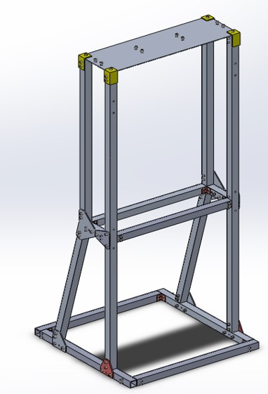
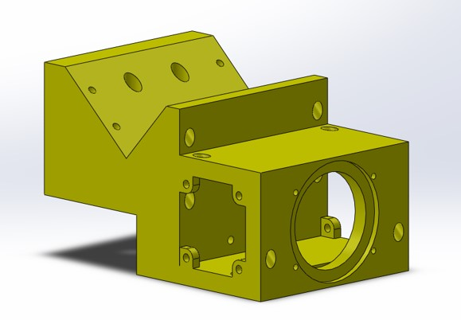
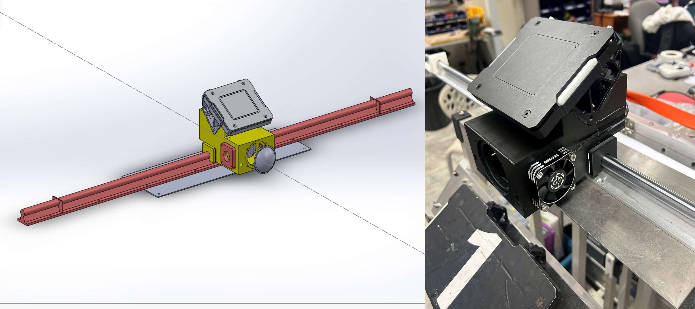
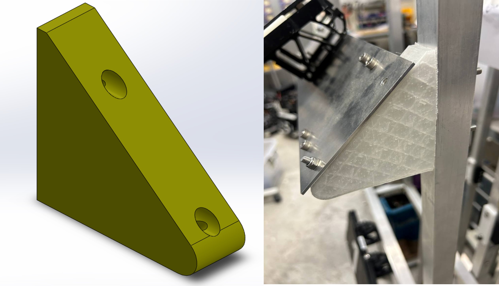
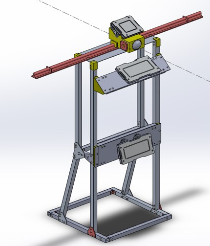
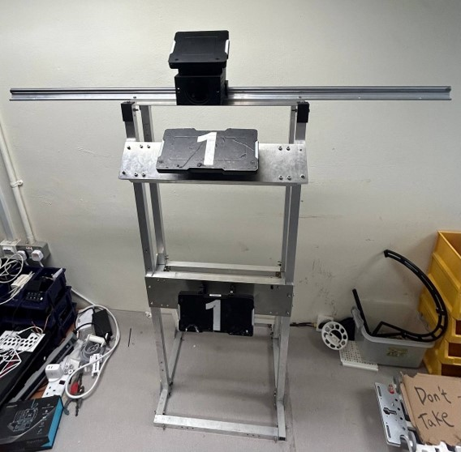

# Base
The base structure is a key objective in both attack and defense. Destroying the opponent’s base wins the match. In our project, it is one of two designated targets for the dart robot and projectile. The team will design and fabricate the base as outlined below.

Two iterations are planned:
1. First iteration: a test target for Dart launcher and projectile subsystems.
2. Second iteration: a close replica of the competition base for realistic testing.

As the official base cannot be purchased, an in-house version will be built to support testing of both the launcher and projectile subsystems. Both versions will also be used by the Calibur Robotics team for practice.
## Base: Passive structure
First iteration will include the competition’s essential base components. It will be built quickly as a reliable target for the dart robot and projectile, and for other NUS Calibur Robotics robots.
### Design process: Structure
The base structure was designed to resist impact damage from various projectiles. Due to the short timeline, a proven structural style was adopted. Inspired by the Eiffel Tower, the base uses a truss design—wider at the bottom and narrower at the top (Figure ??). All trusses are made from 2 mm 6061 aluminum hollow square tubing, joined with 3 mm 6061 aluminum gusset plates for alignment and reinforcement.

 

{: .text-center}
 

<em>Figure ??: Truss structure making up main body of base</em>

The back support trusses connecting the base frame to the mid-section are angled and aligned with the expected impact direction of the dart. This prevents structural instability under diagonal impact of the projectile.
### Design Process: Guidance Light Source and cooling system

<!-- VJ please add your stuff here <-->
### Design process: Light indicator component
The base includes a dart target that slides linearly over 980 mm and is mounted 1300 mm above ground on the truss top. A green light, as specified in the competition rules, guides the dart toward the target. Above it, an armor plate inclined at 27° detects hits.

Two design considerations were addressed:
1. The linear motion mechanism.
2. A unified mount for the light, cooling system, and armor plate.

To simplify assembly, all components are fixed to a single 3D-printed mount attached to a linear rail and carriage. Figure ?? shows the mount design, and Figure ??a & ??b shows the CAD model and fabricated component respectively.

 

{: .text-center}
 

<em>Figure ??: 3D printed mounting piece CAD</em>

 

{: .text-center}
 

<em>Figure ??a and ??b: Fully assembly CAD, (a) and fabricated assembly (b)</em>

### Design process: Mounting of armor components
At the client’s request, two extra armor plates were added for use by other Calibur Robotics robots. They are mounted at 487 mm and 1058 mm above ground, with the upper plate inclined 27° as per competition rules.

The mounts use the same truss design, but with 3D-printed TPU pieces between the frame and armor plates to absorb shock from repeated impacts. Figures ??a and ??b show the TPU mount in CAD and after installation.

 

{: .text-center}
 

<em>Figure??a and ??b: TPU mounting piece for top large armor plate CAD, right (a), and fabricated, left (b)</em>

Figure ?? shows the full assembly of the passive base structure with both large armor plates mounted.

 

{: .text-center}
 

<em>Figure ??: Full CAD of the passive base structure</em>

### Fabrication, Assembly, and Testing
All trusses, plates, and gussets were fabricated with support from the NUS Central Workshop using standard request procedures. 

Assembly took place in the same workshop, with minor truss adjustments made to correct fabrication errors. These did not delay progress. The completed setup revealed a useful “self-locking” feature in the linear rail, which holds the slider in place after movement (Figure ??).

 

{: .text-center}
 

<em>Figure ??: Full assembled passive base structure</em>

A dummy dart projectile of the required weight was thrown at the structure five times. The base remained stable with no visible damage or component failure.

### Next steps
The next phase involves designing and fabricating the second base iteration with added components to better simulate competition conditions. These include motorized linear motion for target randomization, movable guard panels for the lower plate, and an ESP32 web server for remote control via user devices.

Below are the tentative Signal and Power diagrams for the Base.
<!-- VJ add your stuff here <-->