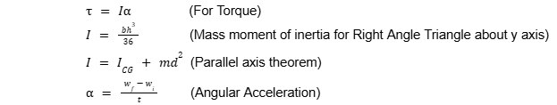
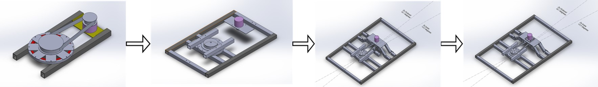
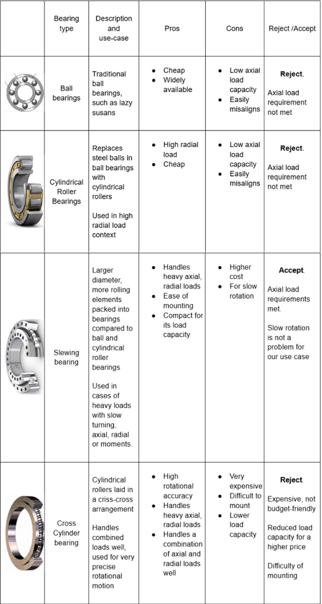
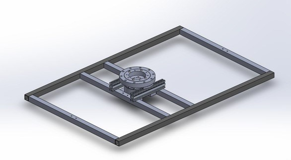
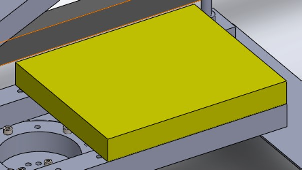

<!-- nav_order is for DROPDOWN NAVIGATION sequence <-->

# Dart Robot
## Introduction
With the dart projectile completed, the next step is developing the Dart Robot to launch it at the target. The robot consists of the Pitch, Yaw, Launcher, and Feeder subsystems, which handle carrying, aiming, and firing the projectiles. Each subsystem is detailed in the following sections.
## Mechanical: Yaw
The yaw subsystem controls the robot’s heading through a single drive system and forms the base frame supporting the upper assembly.
### Load consideration
The yaw subsystem must support the upper assembly—pitch, launcher, and feeder—estimated at 15 kg. The equations used are shown below:

 

{: .text-center}
 
Torque requirements were calculated using angular acceleration and mass moment of inertia (Appendix Figure ??), resulting in a requirement of 37.4 Nm, which guides the drive-system and motor selection.
### Drive system considerations
Drive-system selection was based on:
1. **Accuracy and precision** – required for consistent targeting.
2. **Weight** – total mass must remain under 25 kg.
3. **Maintenance** – fast servicing during competition.
Four possible drive systems were evaluated, as shown in Table ??.

 

{: .text-center}
 

<em>Table ??: Concept Screening Table for Yaw Drive Systems</em>

Chain and belt systems suffer from backlash and need additional space for tensioners and pulleys. Gear systems require high maintenance and are prone to backlash and rolling-contact fatigue. The direct-drive system scored highest and was selected, though its performance depends heavily on motor quality.

The **Damiao DM10010L** motor was chosen as it meets the 37.4 Nm torque requirement with margin, includes an onboard encoder, and matches the client’s existing hardware ecosystem for smoother integration.
### Design consideration: Yaw mount and Robot base frame
The base frame uses 6061 aluminum square tubes to form a rectangular platform supporting the yaw subsystem. Two design approaches were explored during our iterative process.
### Belt-driven system
The first yaw subsystem iteration used a belt-driven design due to familiarity with the system, despite its lower concept score. The concept used a bearing to support rotation with a driven timing gear and a motor offset from the rotation axis (Figure ??, leftmost).

A suitable bearing capable of handling high axial loads was needed. Table ?? lists the bearing types considered and their evaluation.

 

{: .text-center}
 

<em>Figure ??: Ideation process for belt-driven system</em>

 

{: .text-center}
 

<em>Table ??: Bearing types and considerations</em>

A slewing bearing was selected for this design. Additional parts such as the timing gear, belt, and tensioner were added, as shown in Figure ??. Since the final design moved away from the belt-driven approach, the detailed information for this iteration is included in Appendix ?.

### Direct-drive system
After review with supervisors and the team, a direct-drive system was chosen for reduced mechanical complexity and fewer failure points, and its higher concept score.

The slewing bearing was retained, and belt-related components were removed. Figure ?? shows the direct-drive system mounted on the base frame. All subsystems will be installed on the slewing bearing in the final assembly.

 

{: .text-center}
 

<em>Figure ??: CAD of direct drive system</em>

### Design consideration: Electronics bay
An electronics bay will be added to house components and circuit boards for protected and accessible maintenance. Its planned location is shown in Figure ??.

 

{: .text-center}
 

<em>Figure ??: Current electronics bay location</em>

### Fabrication, assembly, and testing plan
Fabrication and assembly of the yaw subsystem will proceed after integrating the pitch subsystem. Load testing will follow in the next project phase. Figure ?? shows the full dart robot assembly with tentative parts for motion visualization.

 

{: .text-center}
 

<em>Figure ??: Tentative CAD of full dart robot assembly</em>

### Next Steps
Motor electronics will be integrated to test the subsystem’s yaw motion. This will be carried out in the project’s second phase.

<!-- Insert all captions at center of page <--> 