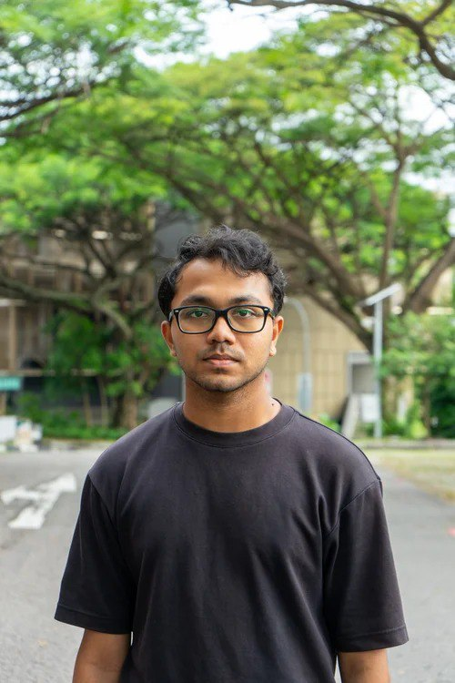
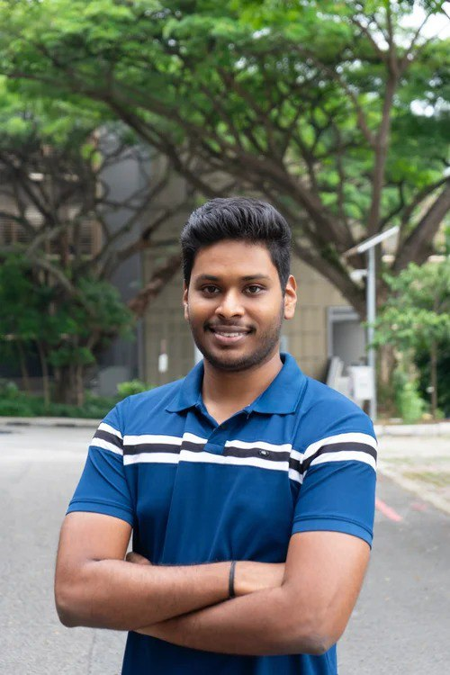
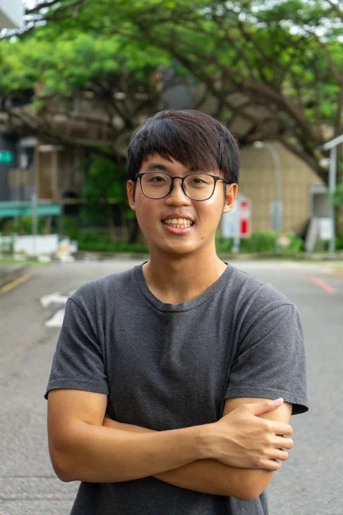
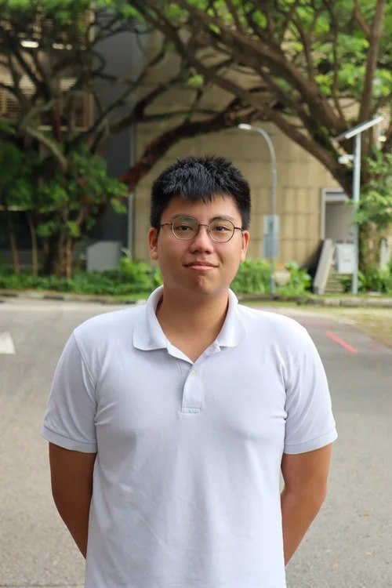

# The Team
---
title: Manpower Allocation
nav_order: 2
has_children: true
layout: default
---

# Manpower Allocation

Below is the breakdown of responsibilities for each subsystem.

  

    
    
VJ A0261513N Electrical

    

      <a href="{{ '/Projectile - Electrical & Software/' | relative_url }}">Projectile - Electrical & Software</a> 
      <a href="{{ '/Base Structure/' | relative_url }}">Base Structure</a>
    

  

  

    
    
Shyam A0251760J Mechanical

    

      <a href="{{ '/Projectile - Mechanical Design/' | relative_url }}">Projectile - Mechanical Design</a> 
      <a href="{{ '/Launcher - Mechanical Design/' | relative_url }}">Launcher - Mechanical Design</a>
    

  

  

    
    
Barry A0258254Y Electrical

    

      <a href="{{ '/Launcher - Electrical & Software/' | relative_url }}">Launcher - Electrical & Software</a>
    

  

  

    
    
Jian Wen A0252100E Mechanical

    

      <a href="{{ '/Dart Robot - Yaw Subsystem/' | relative_url }}">Yaw - Mechanical Design</a> 
      <a href="{{ '/Dart Robot - Pitch Subsystem/' | relative_url }}">Pitch - Mechanical Design</a> 
      <a href="{{ '/Base Structure/' | relative_url }}">Base Structure</a>
    

  

