# Introduction
### Abstract
This project aims to develop a projectile launcher and projectile to hit targets in the RoboMaster University Championship (RMUC). To do so, ASI - 403 would be building an accurate mock - up of the target for testing, implementing in-flight corrective functionality into the projectile and adjustable pitch & yaw and auto projectile reloading for the launcher. Predictive Maintenance and easy debugging & maintenance is prioritized.
## Overview of RoboMaster University Championship (RMUC)

Founded in 2013, DJI RoboMaster University Championship (RMUC) is an annual international robotics competition organized by Da-Jiang Innovations (DJI) in China. Teams would develop different robots to perform combat on the battlefield. 

 
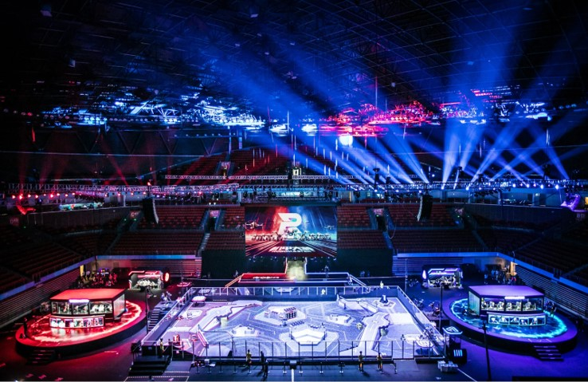
{: .text-center}
 

<em>Figure XX: Top view of the battlefield</em>

The goal is to launch projectiles at the pressure sensors of opponent robots and targets to defeat them.

## Targets

 
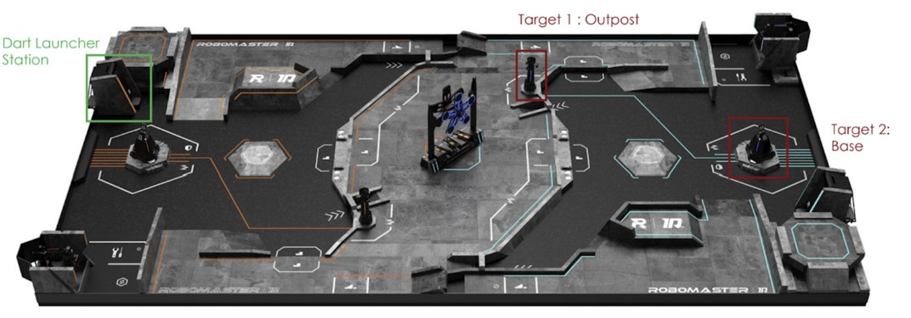
{: .text-center}
 

<em>Figure XX: Battlefield with Labelled Target Locations</em>

 
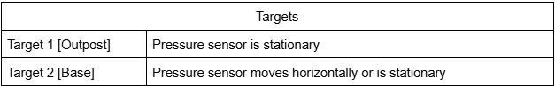
{: .text-center}
 

<em>Table XX: Target Pressor Sensor Description</em>

## Winning Criteria

 
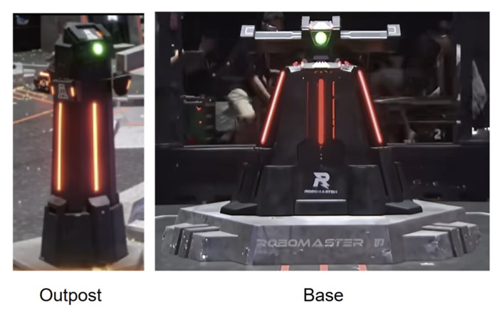
{: .text-center}
 

<em>Figure XX: Close up of Targets</em>

A team wins if the opponent's base HP reaches zero OR its base has more remaining HP than the opponent’s at the end of the match. Base is invincible until outpost is destroyed.

## Armour Modules

 
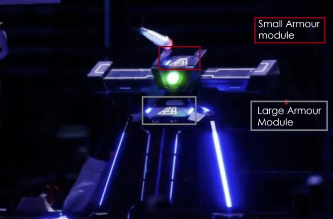
{: .text-center}
 

<em>Figure XX: Base with Small and Large Armour Modules</em>

Most robots and targets, such as Base, use armor modules — official game system components with pressure sensors—to register hits which decreases health.

 
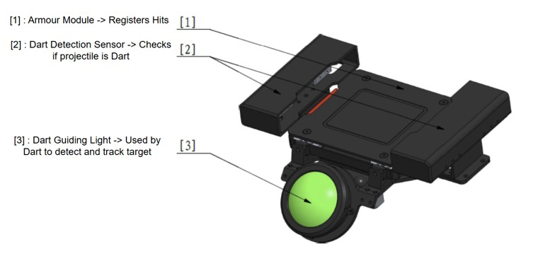
{: .text-center}
 

<em>Figure XX: Close up of Dart Detection Module which is on the Targets (Outpost & Base)</em>

## Robot Roles

 
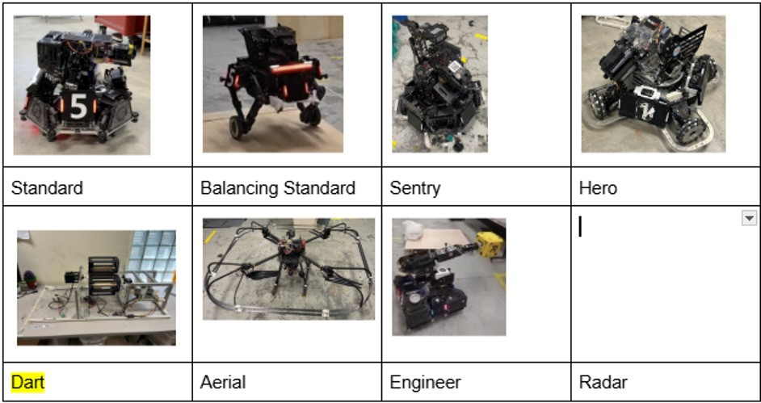
{: .text-center}
 

<em>Table XX: The current NUS Calibur Robotics robot lineup</em>

ASI - 403 would be building a new DART robot. (See Appendix XX for description of other robots)

## Launch Window Mechanics

 
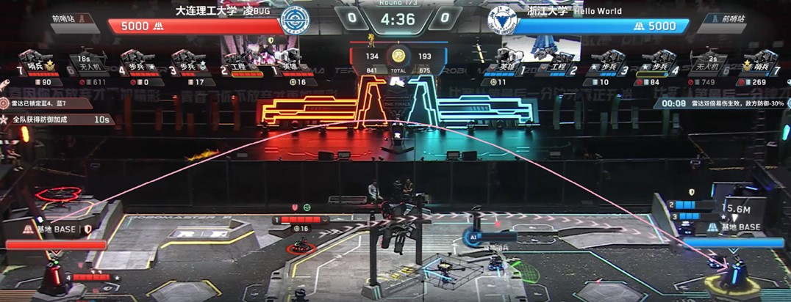
{: .text-center}
 

<em>Figure XX: Example Projectile Flight Path</em>

The robot holds up to four projectiles and stays inside the Dart Launching Station with a gate that can open twice per round—once after 30 seconds and again after 4 minutes from the start of the round. Each opening lasts 20 seconds, followed by a 15-second cooldown. Unused openings can be used after the 4 minute mark.

The operator selects which target (Outpost/Base) the Dart Robot aims at each opening. The team wants us to aim at base.(Strategy explained in Appendix XX)

## Base Targeting Mechanics
Teams can select the desired Base target difficulty. 

 
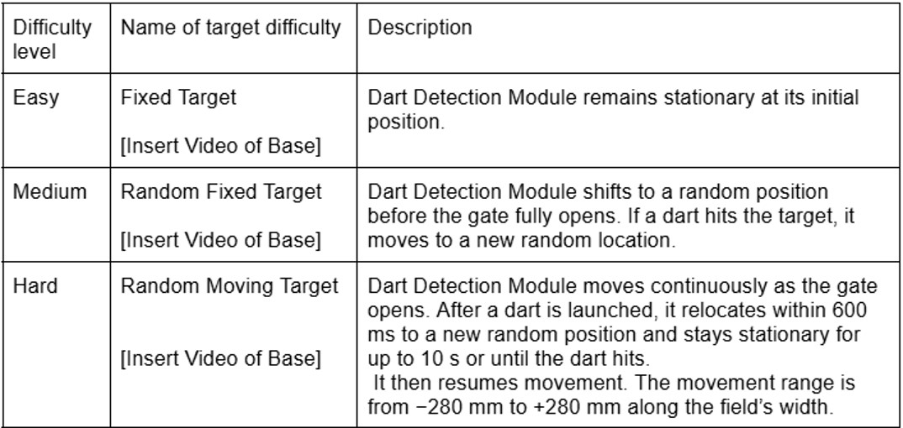
{: .text-center}
 

<em>Table XX: Base Target Difficulty Levels</em>

Higher difficulty levels increase the damage dealt and debuffs applied to the opponent, while granting greater buffs to the attacking team upon a successful hit. (See Appendix XX for the damage mechanisms and the buff & debuff mechanisms)

# Past attempts’ challenges and our improvements
Since 2022, NUS Calibur Robotics has made several attempts to develop a dart robot and projectile capable of accurately hitting competition targets.
## Dart Projectile
Earlier designs suffered from unstable flight due to weak aerodynamic choices (Figure ??). This guided our new approach, which focuses on fin geometry, airflow behaviour, and roll control. The projectile will also be upgraded to an active design capable of adjusting its trajectory toward the target.

 
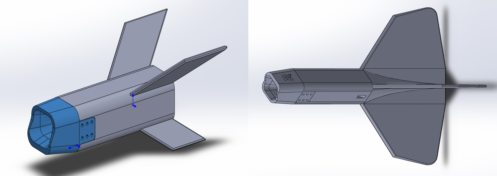
{: .text-center}
 

<em>Figure ??a (left) and Figure ??b (right): Past attempts at the dart projectile</em>

## Dart Robot
Past robots showed unreliable pitch–yaw control, base instability, and inconsistent release (Figure ??). These issues shaped the new design, which prioritizes stable actuation and a stronger frame. The flywheel launcher will be replaced with an elastic band system for more consistent release and improved accuracy.

 
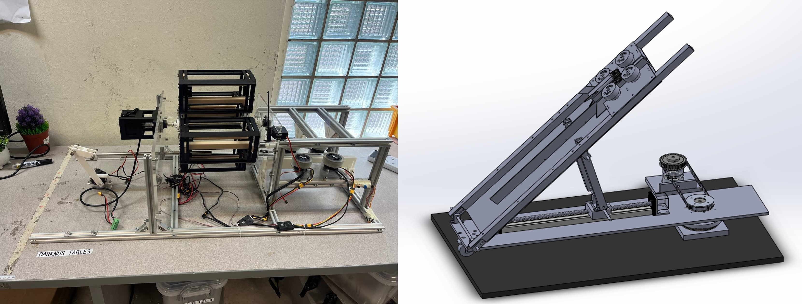
{: .text-center}
 

<em>Figure ??a (left) and Figure ??b (right): Past attempts at the dart robot</em>

## Steps forward
Insights from earlier attempts guide our integrated redesign. The projectile will be developed first, with improved aerodynamics and active-flight components. The robot will follow with reliable pitch–yaw control, a stable frame, and a simplified launch mechanism to support accurate, repeatable shots.

# Value proposition
## Stakeholders
### NUS Calibur Robotics
The goal of NUS Calibur Robotics is to compete in RMUC, which marks as a significant step up from previous years where the team only participated in the RoboMaster University League (RMUL), a smaller competition with fewer requirements. This aspiration is strongly encouraged by one of the team’s main sponsor, who views RMUC participation as an important milestone and a natural progression for NUS Calibur Robotics. With the discontinuation of the affiliation between RMUL and DJI, the motivation to advance to RMUC has become even stronger. Although the dart system is not a mandatory requirement for entry, its absence was one of the key factors that limited the team’s eligibility for RMUC 2025. As eligibility is bell-curved across all teams, producing a functional dart prototype by March next year is therefore crucial to demonstrate the team’s technical capability and readiness for RMUC qualification.
### Robomaster Organization Community (DJI RMOC) 
The RoboMaster Organizing Committee (RMOC), founded by DJI, is the governing body that oversees the RoboMaster competitions. RMOC establishes and updates the rule manual, building specifications, and technical assessment criteria for all participating teams to ensure fair, transparent, and competitive gameplay. The rule manual outlines the competition gameplay, including game objectives, field layout, and damage scoring. While the building specifications provide guidelines for robot design, setting limits on dimensions, weight, and power. Lastly, the assessment criteria is used to filter for teams with the best technical competency.
## Value Proposition Canvas
With the stakeholders identified and NUS calibur robotics chosen as our main stakeholder, a value proposition canvas was done below.

 
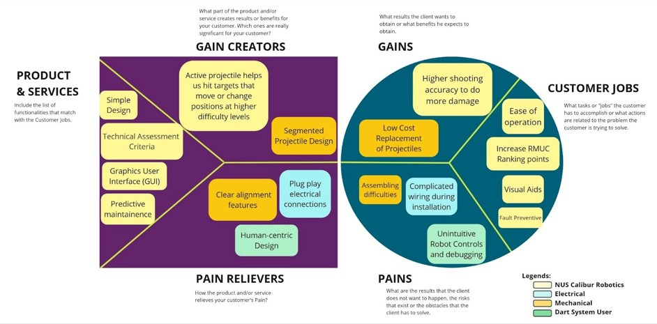
{: .text-center}
 

<em>Figure ??: Value Proposition Canvas</em>

After drafting the value proposition canvas, our value proposition statement is formulated from the value proposition canvas.
## Value Proposition Statement
Our team aims to help **NUS Calibur Robotics** build a simple and accurate dart system through clear alignment features with plug-and-play electrical connections and active projectiles able to hit the target at all difficulty levels.

This dart system will also be competition-ready, which is to comply with the rules and regulations set by the **RMOC**.

The dart system will abide by the technical assessment criteria set by **RMOC** and provide **NUS Calibur Robotics** with additional ranking points.

# DESIGN SPECIFICATION
We have two customers with different requirements that our DART project will have to satisfy, DJI RMOC committee who organise this competition and set the rules and regulations, and NUS Calibur Robotics who will be using our Dart Robot in its entirety after our project ends. Firstly, from the Robomaster Organization Community (DJI RMOC) standpoint, here are the requirements:

## RMOC Standpoint Requirements:
### Arena Setup

 
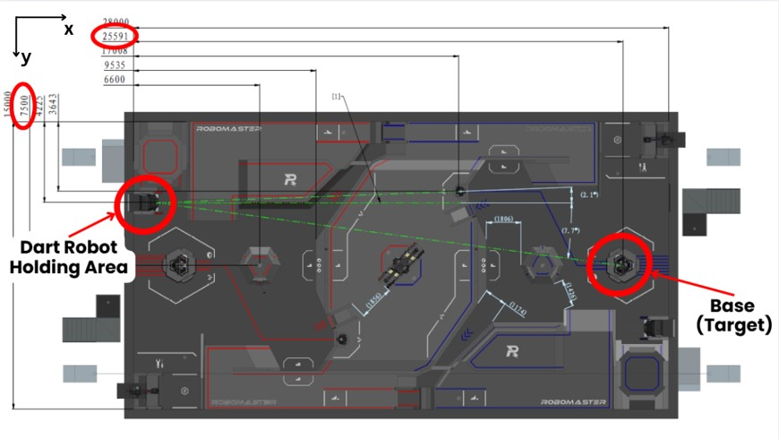
{: .text-center}
 
 
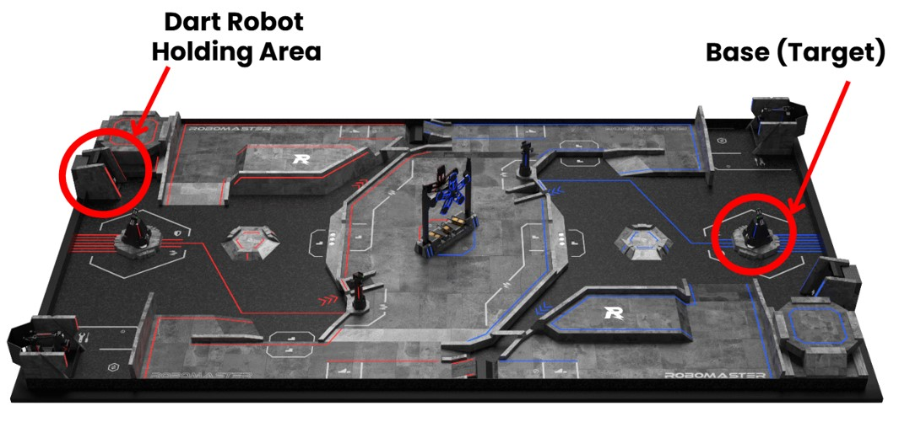
{: .text-center}
 

<em>Figure xx & xx: Complete Arena Setup with dimensions specified</em>

1. The backend of the Dart System will be positioned exactly x-distance 25591mm away from the target, and has to turn 7.7 degrees to the right in order to align with the center mark of the target plate. The y-distance is exactly 3275mm. 

 
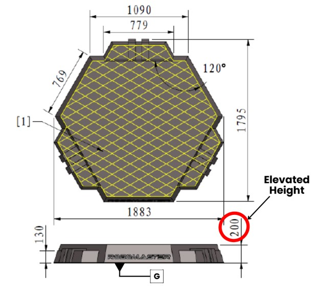
{: .text-center}
 

<em>Figure ??: Base Target structure’s platform</em>

2. The entire base target structure sits on a platform that is elevated off common ground by 200mm. This key information is vital to add to the dimensions highlighted in the next Figure[ ], and these values are key for the launcher calculations in accurately hitting the target.

 
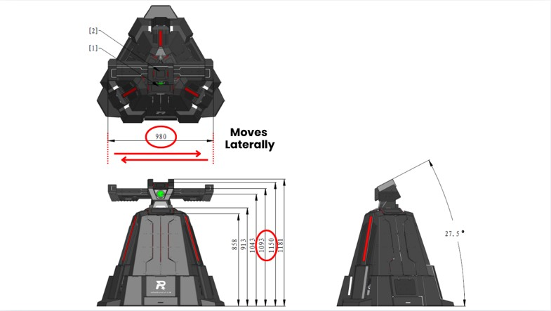
{: .text-center}
 
 
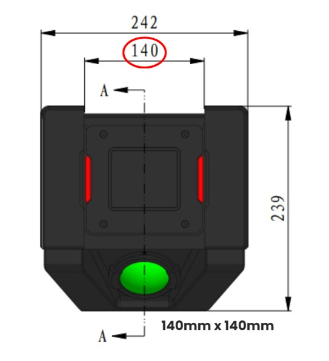
{: .text-center}
 

<em>Figure XX & XX: Base Target Plate and Base Target Structure</em>

3. The target plate is able to move laterally a distance of 980mm. Target is a small armour plate (square shape, 140mmx140mm) tilted 27.5degrees from the horizontal plane. ***From a vertical standpoint***, the allowable range for a successful hit is y∈{1293mm,1350mm}. For accuracy, let us aim for bullseye, **y=1321.5mm**.

 
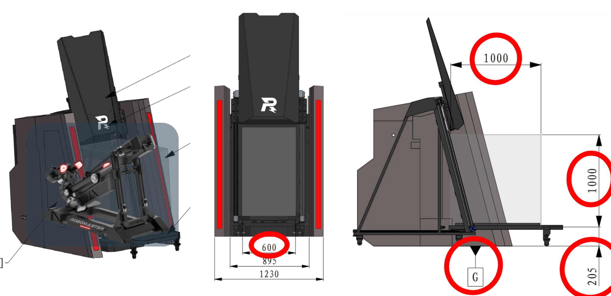
{: .text-center}
 

<em>Figure XX: Dart Robot Holding Station</em>

4. The Dart Robot will be placed inside the Dart Robot Holding Station prior to the match, and hence must abide by the Size restriction 1000mmx600mmx1000mm (LxBxH).Keep in mind the dart system is placed on the sliding platform that is 205mm elevated from common ground.

## ROBOT BUILDING SETUP

**Dart System Regulations:**
The Dart Robot consists of the Yaw, Pitch, Launcher and Feeder. The Launcher and Feeder combined can hold *no more than 4 projectiles* prior to the match, and it *may or have ONE projectile pre-loaded before the match*. The Dart Robot serves as the carrier of projectiles and provides them with initial propulsion.

 
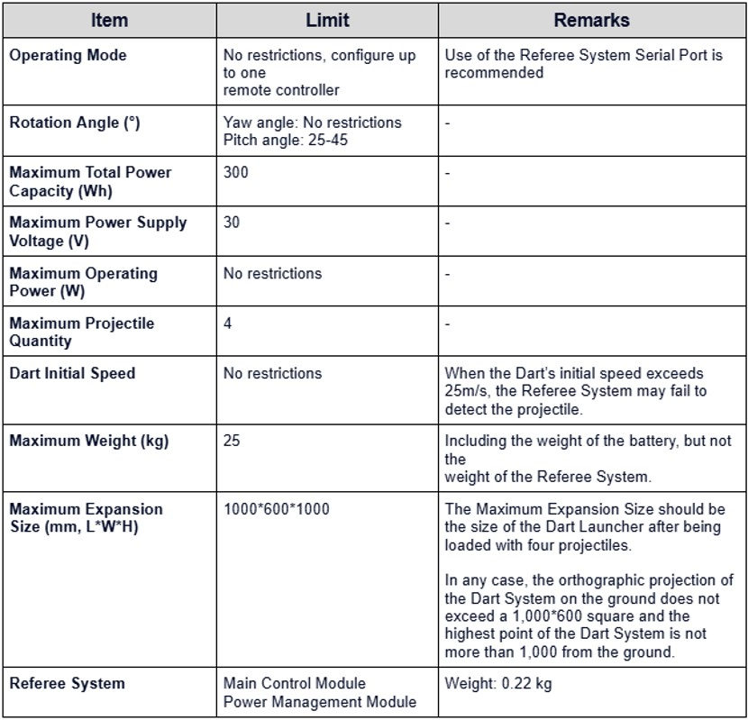
{: .text-center}
 

<em>Table XX: Dart System Production Parameters</em>

**Projectile Regulations:**

 
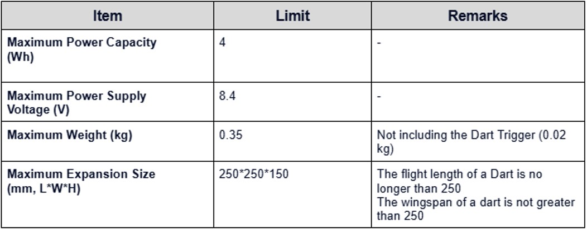
{: .text-center}
 

<em>Table XX: Projectile Production Parameters</em>

 
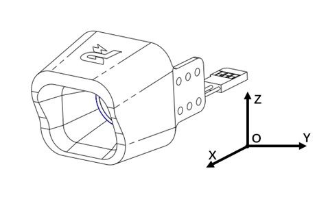
{: .text-center}
 

<em>Figure XX: ?????</em>

The Dart Trigger designated by the RMOC will be mounted on our custom Projectile. This is a competition requirement and cannot be changed or modified. The Dart Trigger is a cream-white translucent shell made of TPU, with a mass of 20 g. Its external form is shown above.

After the Dart Trigger is mounted, ensure its top, bottom, left, and right sides are not blocked by the projectile structure. Within a hemisphere of a 125 mm radius centered on the central point of the bottom surface of the Dart Trigger, there must be no blockage, as shown in the figure below.

 
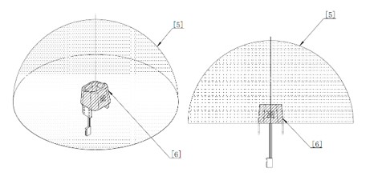
{: .text-center}
 

<em>Figure XX: ?????</em>

Dart cameras or other devices can be mounted in the internal cavity of Dart Trigger. The mounting area shall not exceed the shadow area, as shown below.

 
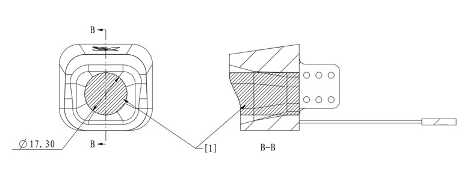
{: .text-center}
 

<em>Figure XX: ?????</em>

## Design Approach

<!-- download and insert the damn functionality table here <--> 
Our team has compiled both the requirements from NUS Calibur Robotics and DJI RMOC’s rules and have formatted them into a functionality table. This table clearly pins down the requirements into their respective specifications that we will have to adhere to, and more importantly the Functionalities we will have to deliver.

# Job Scope
Do we still need this portion lmao