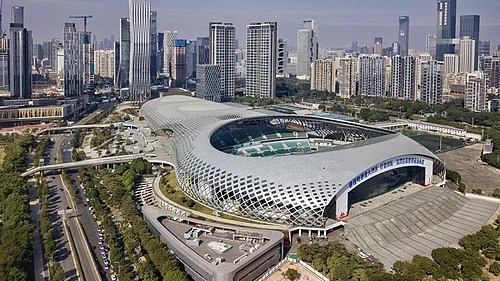
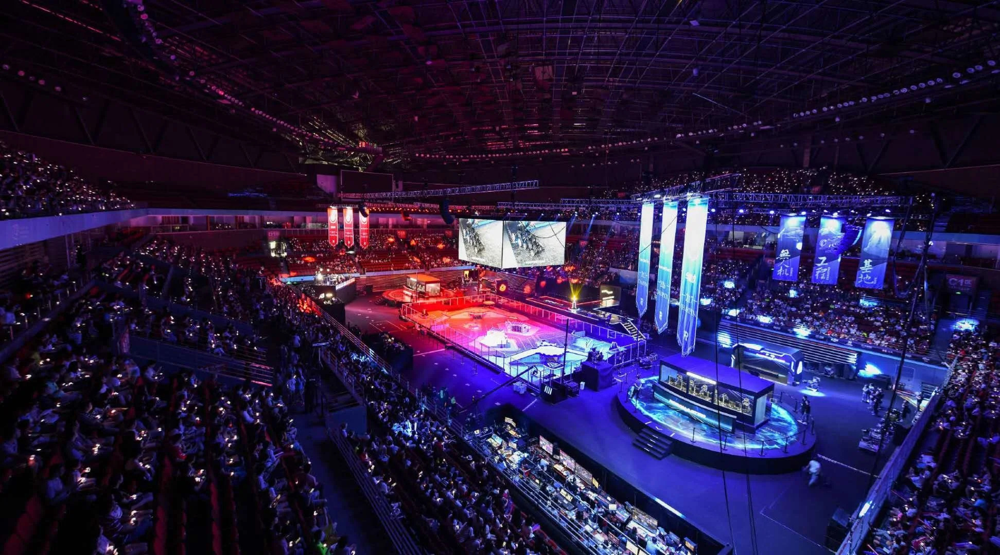
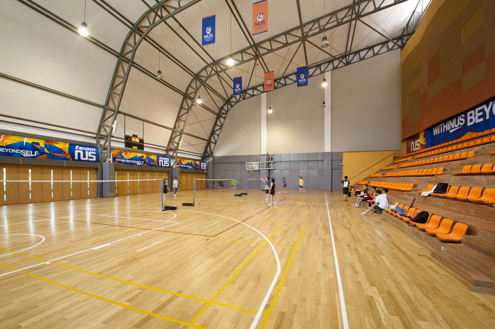

## Dart Projectile

## 1. Foreground
The projectile is the primary payload of the DART system, and its design was a foundational focus of this project. The projectile's geometry and mass are critical system-level constraints that directly influence the design of the **feeder mechanism** and the **launcher**.
The project is governed by strict parameters from the competition organizer, RMOC, which define the maximum allowable size, weight, and power limits. However, the specific aerodynamic design of the projectile is unrestricted, requiring a rigorous development process involving iterative design and **Computational Fluid Dynamics (CFD) analysis.**

 

{: .text-center}
 

<em>Figure 1: The Shenzhen Bay Sports Center Stadium, the competition venue.</em>

 

{: .text-center}
 

<em>Figure 2: The enclosed competition arena, which has internal HVAC-induced crosswinds.</em>

A critical step before simulation was to establish the environmental base parameters. Misinterpreting these conditions, such as air density or wind speed, can invalidate CFD results.
The competition will be held at the Shenzhen Bay Sports Center Stadium, an enclosed, 48,210-square-meter arena. While NUS Calibur Robotics suggested this indoor location would have no wind, our team identified a significant risk of **internal crosswinds**. This was based on direct observation of large-scale **HVAC (air conditioning) units** during a 2024 site visit.
Therefore, despite the "enclosed" setting, a key design requirement was to **ensure projectile stability in the presence of crosswinds**, departing from the initial client assumption of a static-air environment.

 

{: .text-center}
 

<em>Figure 3: Our DART System testing area at the NUS Engineering Auditorium.</em>

 

{: .text-center}
 

<em>Figure 4: Enclosed Multi-Purpose Sports Hall used for additional testing.</em>

For the design of the projectile, we decided to adopt a **first-principles design methodology**. This is a Problem-solving approach that involves breaking down a complex issue into its most fundamental truths to build innovative solutions from the ground up.
We intentionally began with simple, passive prototypes. This was critical for us to learn the fundamental pain points of stability and drag, before we could justify adding the complexity of an active system. Our first prototypes were a rapid exploration of basic concepts.

### Iteration Path:

* **Passive projectile design:**
    * V1 (Thorn) → V3(Crossblade) ✅
* **Parallel investigation (Conceptual Detour):**
    * V2 (Glider) ❌
* **Active projectile design:**
    * V4(Xwing) → V5(Xwing 2) → V6(Trident) → V7(Hunter) ✅

$$D = \frac{1}{2} \rho v^2 C_D A$$

<strong> 2. Ground Rules </strong>

Certain ground rules were established before beginning on the projectile designs. Here are the full design considerations, prior to beginning any design. Along the way, many other considerations were made which will be further elaborated below each projectile design respectively. 

* All projectile designs **SHALL NOT EXCEED 250mm x 250mm x 250mm**
* All projectile designs **SHALL BE BELOW 350g** under Solidworks evaluate tool, after specifying the material to be TPU 95D
* All projectile designs **will accommodate the DART TRIGGER** provided by RMOC
* All projectile designs will be designed to **NOT ROLL NATURALLY**, meaning the mechanical design will ensure the projectile does not roll without the need of corrective measures (such as active control surfaces)
* All projectiles will undergo Computational Fluid Dynamic analysis (CFD) on Solidworks, mainly for 2 reasons. 
First would be **straight line drag**, to minimize parasitic drag. From our literature review, a standard dart projectile has a linear velocity of 25m/s. We will analyze the cut plot of the projectile.
Second would be the **pressure distribution in the case of crosswinds**, which is to analyze if design can counter induced roll. We will induce a crosswind by setting x=25m/s, y=5m/s and z=5m/s to give a net speed of 25.98m/s, and we will analyze the pressure distribution across the projectile body.

<strong> 3. Center of Gravity vs Center of Pressure Analysis </strong>

A baseline requirement for all projectile prototypes is passive static stability. This is achieved when the aerodynamic Center of Pressure (CP) is located behind the mass-based Center of Gravity (CG). This arrangement creates a "weather vane" effect, which is essential for a stable, predictable flight.
A two-step validation process will be applied to each of the seven design iterations to verify this condition.
The CG location for each prototype will be determined using a dual-method approach for accuracy:

The 3D-CAD model in Solidworks will be used to calculate the theoretical CG based on the specified material densities of all components. The calculation will then be physically validated by fabricating the prototype and performing a practical suspension (or "string test") to find its precise real-world balance point.
While the precise location of the CP is complex to derive analytically, a qualitative test will be performed on each prototype to confirm its inherent static stability. This test involves suspending the projectile from a string in front of a high-speed fan.
A successful validation occurs when the projectile immediately and stably orients itself into the wind and does not tumble. This behavior serves as a practical confirmation that the design possesses a positive static margin and that the CP is, as required, located behind the CG.

<strong> 4. 2 wings vs 3 wings vs 4 wings Analysis </strong>

The selection of a four-fin "X" configuration over a two- or three-fin layout was a critical design choice driven by the demands of an active control system.
A two-fin, plane-like configuration (as explored in Prototype 2 "Glider") was fundamentally unsuitable. This design generates significant, uncontrolled aerodynamic lift, which destroys the predictable ballistic trajectory required for a 100mm target. Furthermore, it possesses no passive yaw stability, making it aerodynamically unstable as a projectile.
A three-fin "Y" configuration, while passively stable, was rejected due to control complexity. For an active system, a three-fin layout creates a **coupled control problem**. A pure "pitch" or "yaw" command cannot be executed by a single pair of fins. Instead, a complex **"control mixing" algorithm** is required to calculate the correct deflection angle for all three servos simultaneously. This adds unnecessary computational overhead and tuning difficulty.
To pitch straight up, you might only use the one bottom fin. To yaw left, you have to move both the top-left and top-right fins in a complex ratio.This is called **coupled control**. To move in any direction, we would have to run a "control mixing" algorithm that calculates the correct angle for all three fins. This is more complex, harder to tune, and can lead to unexpected cross-coupling effects.
With a **3-fin system**, a pure pitch-up maneuver relies on **only one fin** (the bottom one). This puts the entire load onto that single fin and servo, requiring it to be stronger (and likely heavier) to produce the same control force.

The four-fin "X" configuration was chosen because it provides a robust, **decoupled control system**. This layout provides two independent control axes:
With a **4-fin system**, any pitch or yaw command is handled by **two fins** working together. This distributes the aerodynamic load and the work across two servos, making the system more robust and responsive.
These axes are **decoupled**. When we command a "pitch up," we don't cause a yaw. This makes the control logic **dramatically simpler**. We can run two separate, simple PID controllers: one for pitch, one for yaw. It also distributes the aerodynamic load for any maneuver across two servos, increasing system responsiveness and robustness.

## 5. Projectile Design

## V1 THORN

Prototype 1, "Thorn," was our baseline. A simple, passively-stable ballistic dart projectile. The goal was to establish a "control group"—the most basic, robust design to benchmark stability and manufacturing. Its cruciform ("+") fin configuration proved to be perfectly stable, as confirmed by CFD, which showed the fins correctly generated restoring forces to cancel out roll.
However, the CFD also revealed a fatal, high-impact flaw: critically high drag. The combination of a non-aerodynamic square body and a blunt, flat base created a massive, turbulent wake. This resulted in an exceptionally high drag coefficient (CD) that would demand immense launch energy and make the trajectory highly unpredictable.
"Thorn" proved that stability was easily achieved with inclusion of fins. It was rejected because it taught us the real challenge was managing drag. This forced our subsequent iterations to focus on aerodynamic efficiency and body-shape optimization. hi
