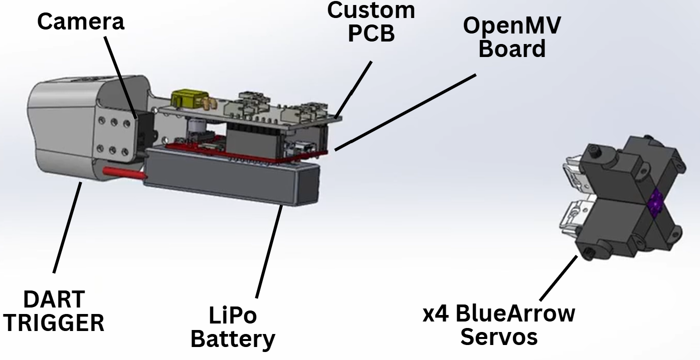

 

{: .text-center}
 

<em>Figure ??: Components_inside_dart</em>

 

{: .text-center}
 

<em>Figure ??: Wiring Connections of Dart Components</em>

 

{: .text-center}
 

<em>Figure ??: Segmented Signal Diagram of Projectile</em>

 

{: .text-center}
 

<em>Figure ??: Segmented Power Diagram of Projectile</em>

