# NUS Team Calibur Robot Firmware

STM32 code for Team Calibur robots, written for the Robomasters Development board A and C (denoted by the letter behind each folder)

<!-- TABLE OF CONTENTS -->

  
Table of Contents

  <ol>
    <li>
      <a href="#getting-started">Getting started</a>
      <ul>
        <li><a href="#prerequisites">Prerequisites</a></li>
        <li><a href="#importing-the-project">Importing the project</a></li>
        <li><a href="#alternative-import">Alternative import</a></li>
      </ul>
    </li>
    <li>
      <a href="#usage">Usage</a>
      <ul>
        <li><a href="#building">Building</a></li>
        <li><a href="#debugging">Debugging</a></li>
        <li><a href="#uploading-the-program">Uploading the program</a></li>
      </ul>
    </li>
    <li>
      <a href="#using-the-debugger">Using the debugger</a>
      <ul>
        <li><a href="#debug-toolbar-overview">Debug toolbar overview</a></li>
        <li><a href="#debug-session">Debug session</a></li>
        <li><a href="#breakpoints">Breakpoints</a></li>
      </ul>
    </li>
    <li><a href="#resetting-perspectives">Resetting perspectives</a></li>
    <li><a href="#updating-st-link">Updating ST-Link</a></li>
  </ol>

## Getting started
### Prerequisites
The code is developed in STM32CubeIDE which needs to be installed through the link [here][STM32CubeIDE-url].

---

### Importing the project
First, pull the code onto your local computer. This can be done by clicking the green Code button on the top left corner followed by "Download Zip"

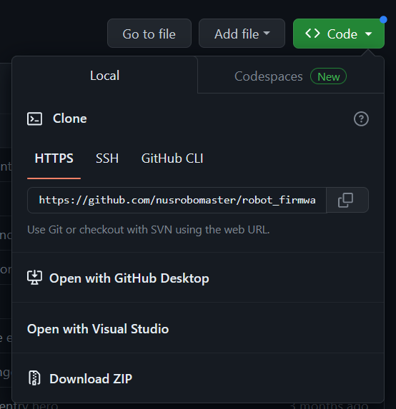

If you plan on developing the code, do read up on how to use [Git](https://git-scm.com/docs/gittutorial) and create your own branch for your own additions first.

Next, extract the .zip file somewhere that is easy to find. Then, open up the CubeIDE and you should be greeted by this screen:

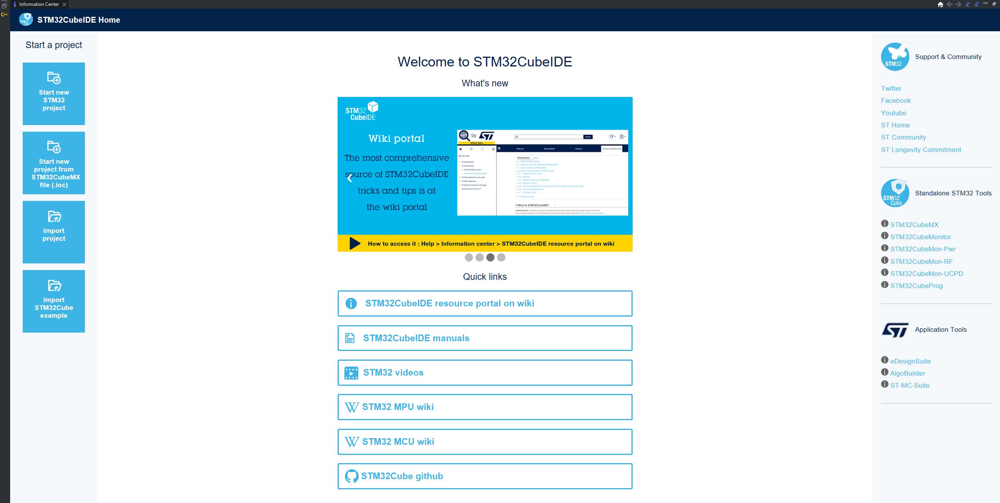

Select the "import project" on the left corner of the screen

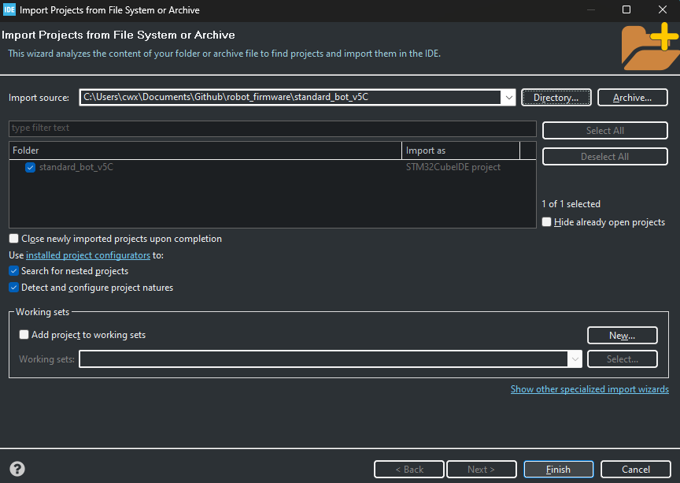

Click on "Directory" and browse to the folder of the specific robot (i.e. standard_bot_v5C). Then click finish

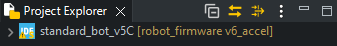

You should end up with the project in the project directory. If the project does not appear in the project directory, refer to alternative import at the bottom of the README

---

### Alternative Import
Locate the STM32 project folder in your file explorer 

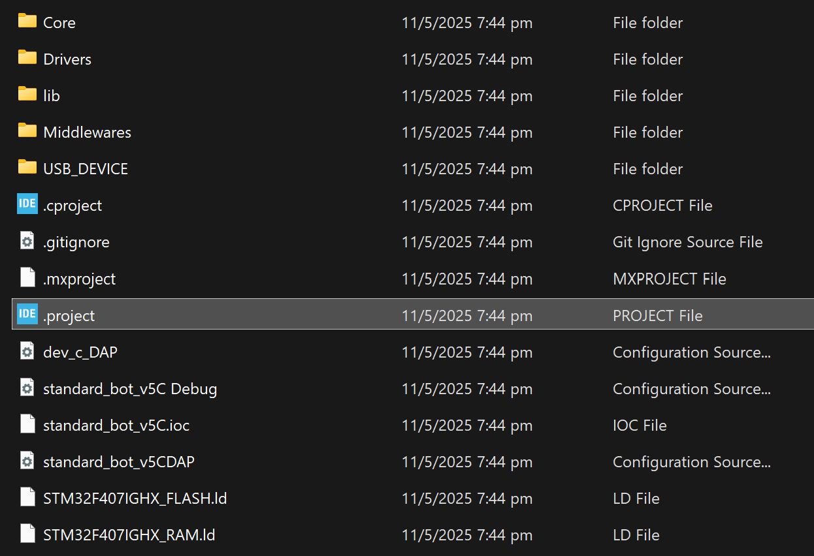

Double click the **.project** file. This will launch STM32CubeIDE and import the project automatically, or directly import the project if the IDE is already open

## Usage
Once the project is successfully imported, you can build and upload the code into the Development boards using the **Build**, **Debug** and **Run** buttons located in the toolbar

---

### Building
To build the project, click the **Build** button in the toolbar at the top of the IDE

As the project is being built, build progress and messages will appear in the **Console** panel at the bottom of the IDE. The information includes:
- Compilation steps 
- Warnings or errors in the code 

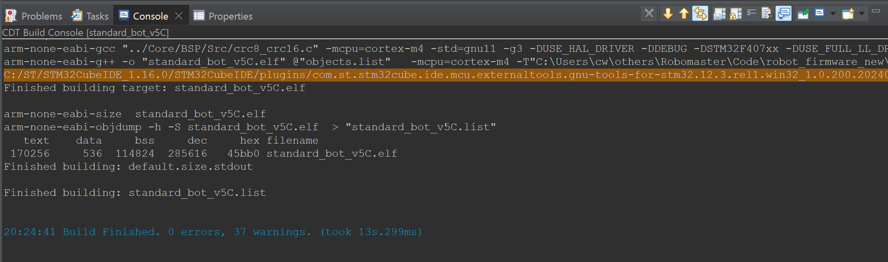

---

### Debugging 
To debug the project, click the **Debug** button in the toolbar at the top of the IDE. This will:
- Build the project (if it is not already built)
- Upload the compiled code to the Development board
- Launch a debug session

If this is your first time debugging the project, you may see the **Debug Configuration** window. 

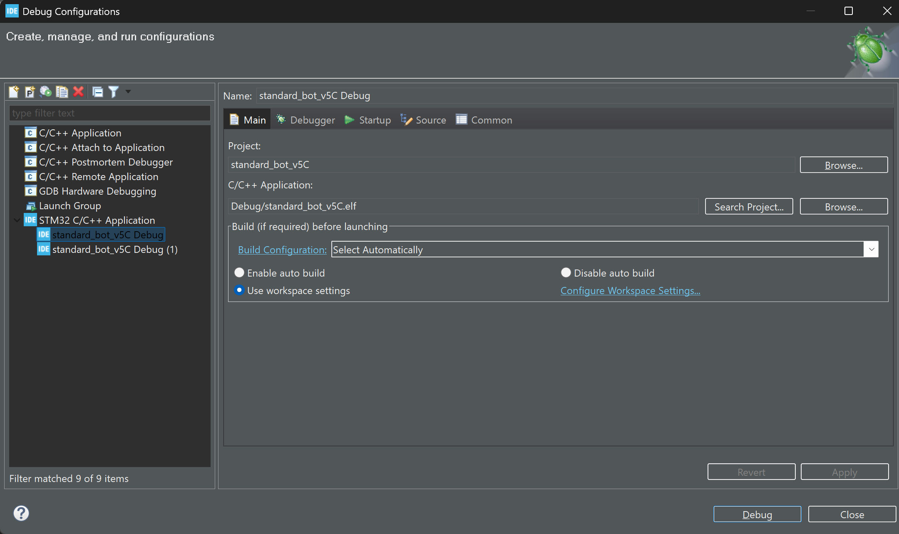

In this window:
- Choose the project you want to debug
- Choose its corresponding `.elf` file

Usually, the default options are correct

---

### Uploading the program
To upload the program to the development board without starting a debug session, click the **Run** button in the toolbar. This will: 
- Build the project (if it is not already built)
- Upload the compiled code to the Development board
- Immediately start program execution

## Using the debugger

### Debug toolbar overview
When a debug session starts, a debug-specific toolbar appears at the top:
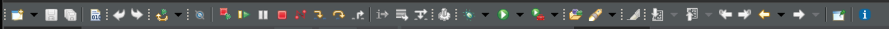

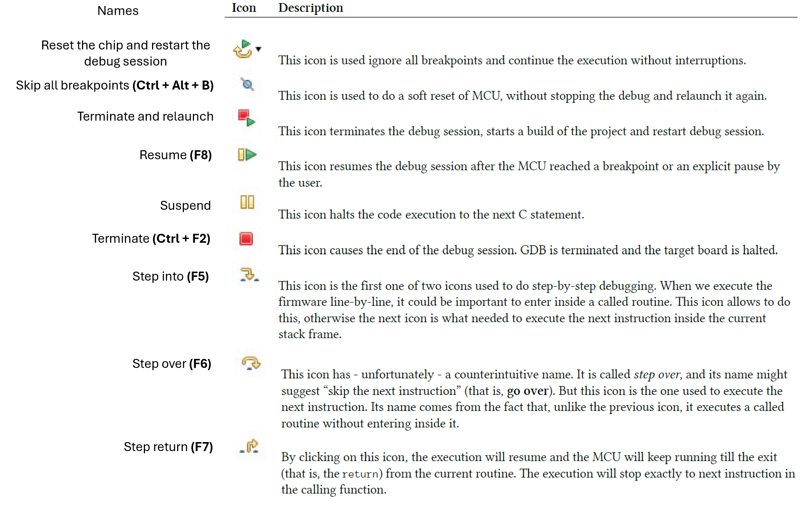
(Descriptions taken from **Mastering STM32 Second Edition**)

---

### Debug session
After clicking the **Debug** button, it may take awhile for the debug session to initialize. The debugger is initialized when it pauses automatically at `HAL_init()` function in `main.c`

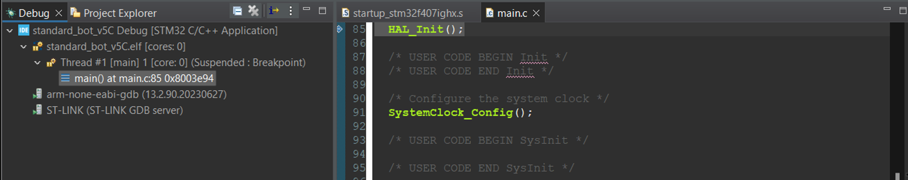

On the right, you will see several sub-panes. The most commonly used will be the:

**Breakpoints** pane – Displays all the breakpoints you've set. You can enable, disable, or delete them here

**Live Expressions** pane – Allows you to monitor specific variables or expressions in real-time as the code runs, even without setting breakpoints

---

### Breakpoints

Breakpoints are used to stop program execution when a specific line of code is reached

To set breakpoints, double click the margin next to the line number in your IDE. All active breakpoints are listed in the **Breakpoints** panel

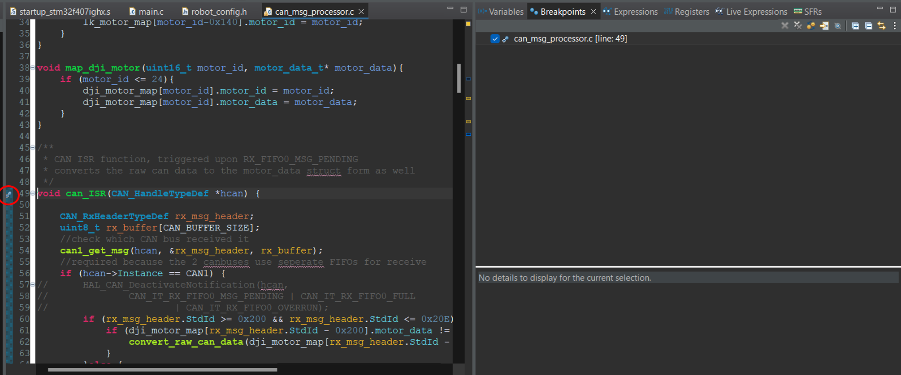

Once the execution is paused, you can step through the code line by line using the **Step Into**, **Step Over** and **Step Return** functions to analyze the progran flow in detail

Breakpoints also help identify if a specific section of code is being executed. When a breakpoint is hit, the program pauses execution at that line, allowing you to inspect the variables, memory and call stack. If the breakpoint is not triggered, it indicates that the program never reached that line of code

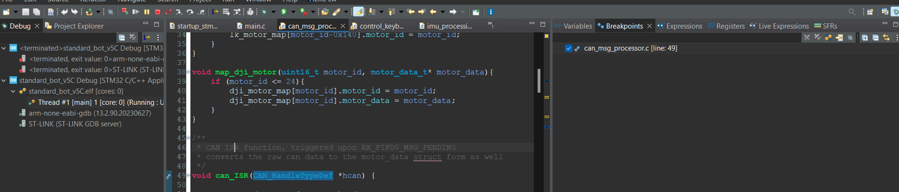

 Breakpoint not triggered for CAN  

In this example, the program does not stop at the `CAN_ISR` breakpoint, signifying that the motor is not sending feedback data back to the Development board

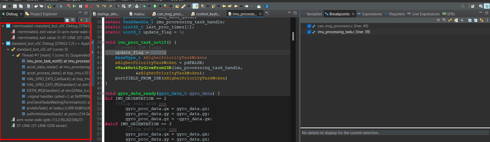

 Breakpoint triggered for IMU  

In this example, the program pauses execution at the breakpoint. The call stack on the left pane also shows how the code reached this point

> Note:  
Be careful when setting breakpoints, especially after sending a speed command to the motor. As the program execution is paused after setting a breakpoint, the Development board no longer sends or receives commands, which could cause the robot to go out of control

## Resetting perspectives
If your IDE becomes cluttered or panels are missing, resetting the perspective will restore the default layout

This can be done by going to **Window > Perspective > Reset Perspective**

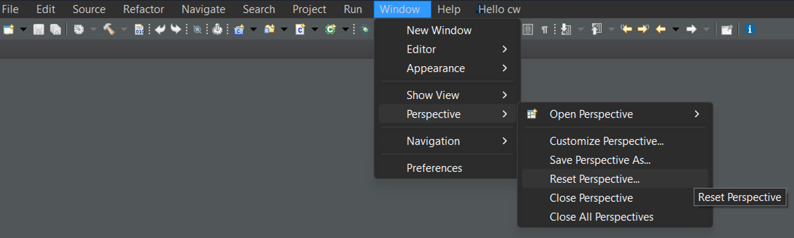

## Updating ST-Link
Your ST-Link must have the latest firmware before you can proceed with flashing or debugging. While the IDE will prompt you to upgrade the ST-Link automatically, you can also update the ST-Link manually using the following steps:
1. Go to **Help > ST-LINK upgrade**
2. Make sure the ST-Link is not connected to the Development boards
3. Click **Open in update mode** - You will see the ST-Link ID
4. Click **Upgrade**

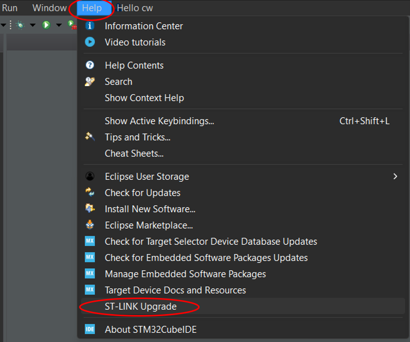
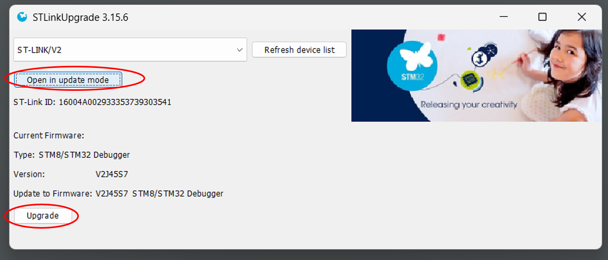

## Stuff to do :<

- Converting IMUs from Blocking functions to DMA/Interrupt based functions (pls)
    - Use DMA functions
    - Ensure GPIO toggles properly with DMA functions
- Shifting PID loops to a single task
    - Ensure PID runs consistently and only after data feedback
- Setup code for chassis board
    - Chassis board individual control
    - Communications between gimbal and chassis board
    - Data feedback from chassis board to gimbal board
- Feedback data for single board computer
    - IMU data
    - Motor odometry data
    - Referee system data 

[download_zip]: ./docs/robotfirmware_github_download.png
[cubeide-pic]: https://www.st.com/bin/ecommerce/api/image.PF267946.en.feature-description-include-personalized-no-cpn-large.jpg
[STM32CubeIDE-url]: https://www.st.com/en/development-tools/stm32cubeide.html